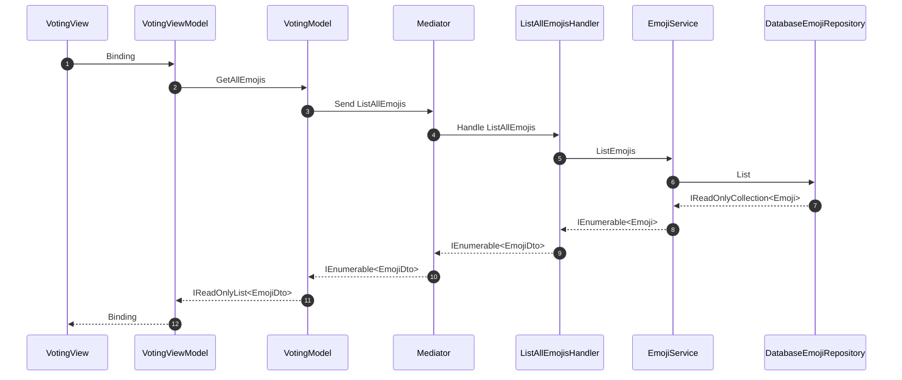
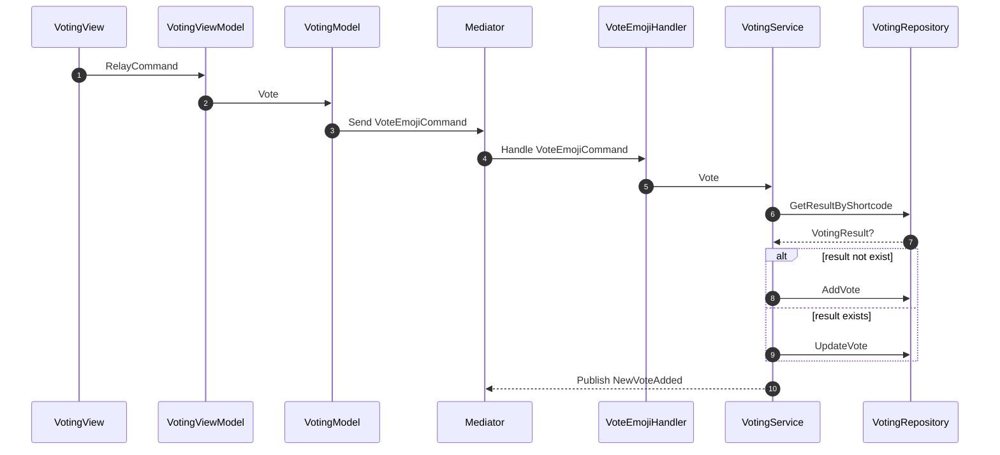
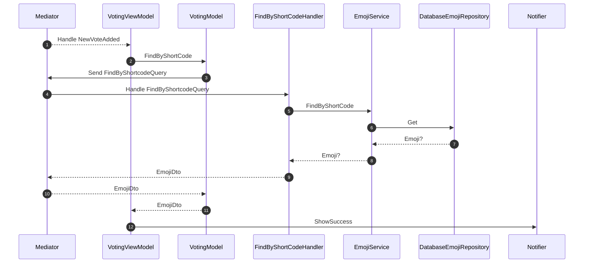
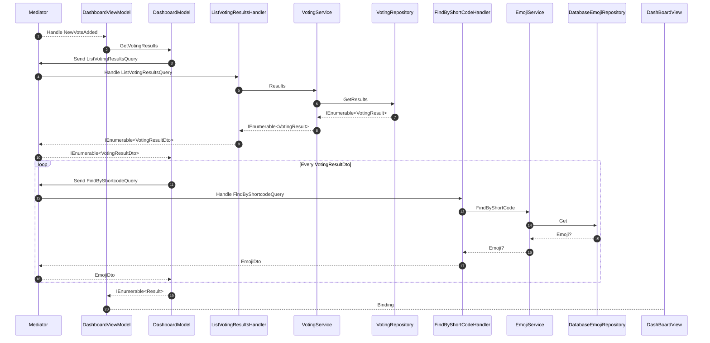
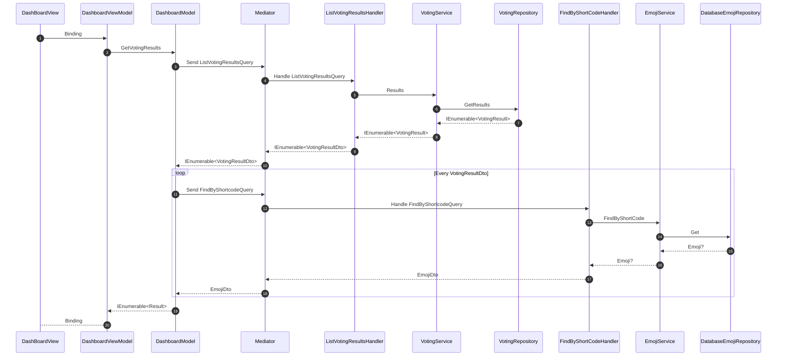

# gui_study

## Sequence diagrams

### Displaying the votable emojis

### Vote on an emoji

### Handle NewVoteAdded in VotingView

### Handle NewVoteAdded in DashboardView

### Displaying the voting results

